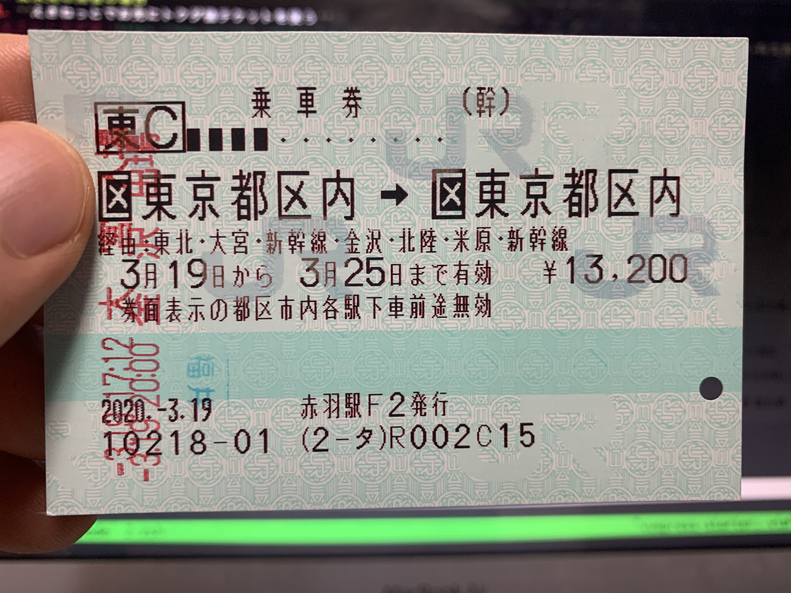

私は現在都内に住んでいるが、実家は北陸の福井県にある。

学生の頃は体力と時間が有り余っていたので、夜行バスの帰省でも問題なかったけれど、  
就職し少ない休日の中、時間と体力を削るくらいなら、多少のお金を支払った方がマシに感じる。

とはいえ、福井と東京の運賃は想像以上に高い。

<iframe src="https://www.google.com/maps/embed?pb=!1m28!1m12!1m3!1d1665720.088885838!2d136.6424595801189!3d35.37153744676324!2m3!1f0!2f0!3f0!3m2!1i1024!2i768!4f13.1!4m13!3e3!4m5!1s0x5ff8beed32739c57%3A0x5b241c3c7faf0f59!2z44CSOTEwLTAwMDYg56aP5LqV55yM56aP5LqV5biC5Lit5aSu77yR5LiB55uu77yRIOemj-S6lemnhQ!3m2!1d36.0621258!2d136.2232754!4m5!1s0x60188bfbd89f700b%3A0x277c49ba34ed38!2z5p2x5Lqs6YO95Y2D5Luj55Sw5Yy65Li444Gu5YaF77yR5LiB55uuIOadseS6rOmnhQ!3m2!1d35.6812362!2d139.7671248!5e0!3m2!1sja!2sjp!4v1588756478567!5m2!1sja!2sjp" width="100%" height="450" frameborder="0" style="border:0;" allowfullscreen="" aria-hidden="false" tabindex="0"></iframe>

参考: GoogleMap

往復で、29,840 円もする。私は三ヶ月に一度は帰省するので、年に 12 万円弱掛かってしまう計算。

帰省することが親孝行と思えば、これぐらいのコストは目を瞑るのも仕方ないのかもしれないけど、  
できれば安く済ませたいと考えるのが、普通だと思う。

そこで如何に現状のまま、運賃だけ安くする方法を調べてみた。

前置きはここまでにして、運賃をハックする方法についていくつかのプランを紹介しようと思う。

## 東京発の帰省の場合

1. **えきねっとでお先にトクダ値チケットを使う**  
   [お先にトクダ値](https://www.eki-net.com/top/tokudane/)チケットとは、JR 乗車券の前売り券のようなもので、乗車券+指定席特急券が 25\%オフされる。  
   このチケットを利用すると、東京-福井間の運賃は以下となる。

```
東京発金沢着: 9,920 円 (お先にトクダ値チケット適用かがやき乗車)
金沢発福井着: 2,540 円

片道: 12,460 円, 往復: 24,920 円
```

4,920 円の割引になる。ほとんど条件が変わらない状態でこの割引額は破格だと思う。  
ただしこのプランの場合は以下の点に注意する必要がある。

- 13 日前の午前 1 時 40 分まで
- 2020 年 3 月 14 日~6 月 30 日乗車分に限る
- 東京発金沢着とは別に乗車券を用意する必要がある

前売り券なので当然事前に予約する必要があり、その期限が 2 週前となる。  
またこのチケットは枚数が決まっているので、2 週間前でも完売する可能性がある。  
なので利用するスケジュールが事前に決まってる場合は、できるだけ早く購入したほうがよい。

2. **乗車券を東京発東京着の片道切符にする**  
   こちらは、JR の運賃が長距離になるほど、1km あたりの運賃が安くなることを利用した方法だ。  
   以下の乗車券のように、東京発東京着かつ一筆書きになるようにすることで、運賃を安くすることができる。



このプランによる運賃は以下。

```
東京発福井着: 5,220 円 (指定席特急券)
福井発東京着: 7,290 円 (指定席特急券)
一筆書乗車券: 13,200 円

往復: 25,710 円
```

プラン 2 は学割も併用できるため、とてもおすすめだ。  
ただしこちらも注意点がある。

- 有効期限は 7 日間である
- 券面に表示された駅で降りたり、途中で通過した駅に戻ったりした場合は、乗車券が回収されてしまう
- 中継駅を指定する必要があり、購入に癖がある

以上のように気をつける点が多く、難易度は高いと考えられる。

はじめて購入する場合は、みどりの窓口で直接駅員と相談しながら購入することをおすすめする。

## 福井発の帰省の場合

こちらは、先ほどのお先にトクダ値チケットの他に[東京往復割引切符](https://tickets.jr-odekake.net/shohindb/view/consumer/tokutoku/detail.html?shnId=119000407)がある。

```
往復: 26,060 円
```

東京往復割引切符であれば、みどりの窓口で直接購入でき、前売りのような条件もないため、難易度は低い。

面倒なことが苦手な人はこちらを購入することをおすすめする。

## おわりに

今回は、帰省にあたり、運賃の見直しを行った経緯をそのまま記事にした。

春の帰省では、一番コスパがよいのがプラン 1 だったので、お先にトクダ値切符に買おうとしたけど、
完売だったので、プラン 2 にした。  
それでも 4,000 円カットできたので、個人的には満足している :smile:
